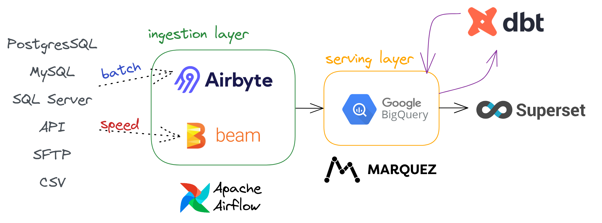
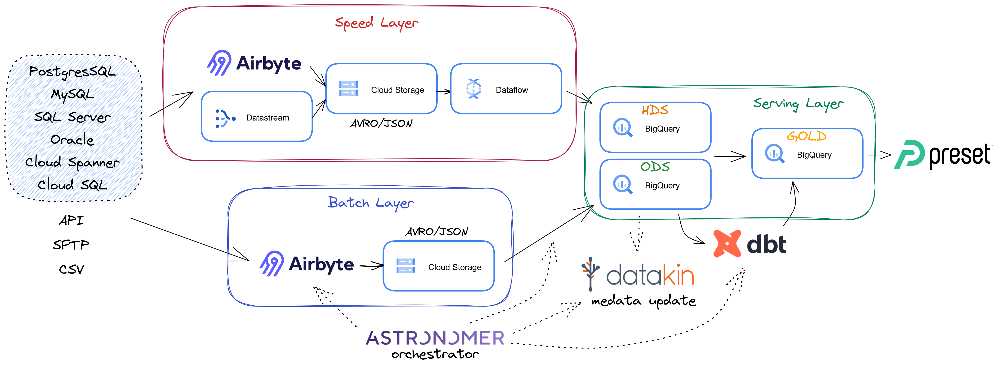

# Covid-19/Retail analysis with a modern data stack

This projects aims to build a *lambda* data architecture using services and technologies from a modern data stack. So, some serverless or PaaS services are prefered than other IaaS services. The same for UI data wrangling services if possible instead of code technologies. The following architecture was developed thinking in this principles and possible main technologies:

As PaaS or serverless services the following architecture aims to give more details about the implementation with use of GCP services, Airbyte cloud, Astronomer platform + Datakin and DBT cloud services:

